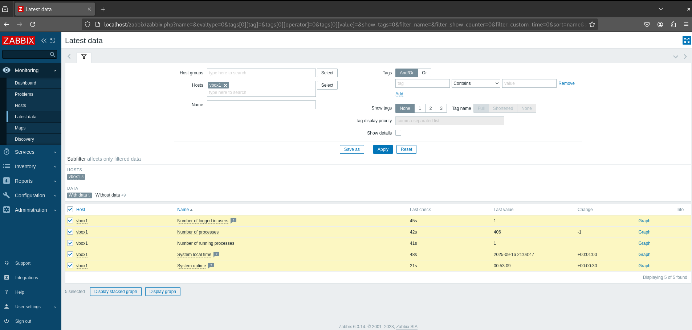
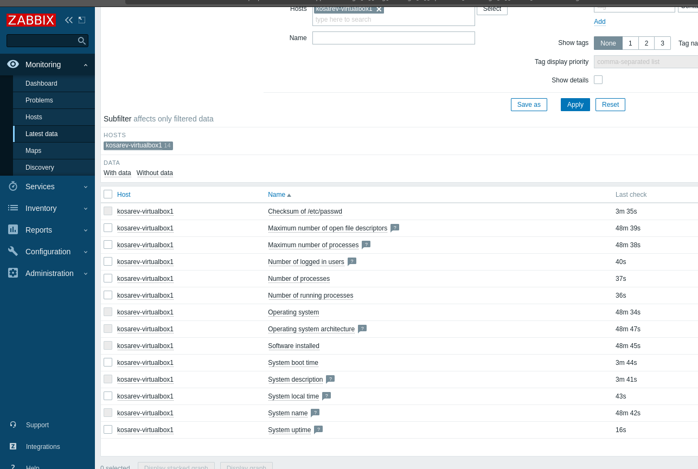

## Screenshot

Zabbix monitoring dashboard

### 1.
sudo apt update && sudo apt upgrade -y
sudo apt install -y postgresql postgresql-contrib
sudo systemctl start postgresql
sudo systemctl enable postgresql

### 2.
wget https://repo.zabbix.com/zabbix/6.4/debian/pool/main/z/zabbix-release/zabbix-release_6.4-1+debian11_all.deb
sudo dpkg -i zabbix-release_6.4-1+debian11_all.deb
sudo apt update

### 3.
sudo apt install -y zabbix-server-pgsql zabbix-frontend-php zabbix-agent

### 4.
sudo -u postgres createuser --pwprompt zabbix
sudo -u postgres createdb -O zabbix zabbix
sudo zcat /usr/share/zabbix-server-pgsql/schema.sql.gz | sudo -u postgres psql zabbix
sudo zcat /usr/share/zabbix-server-pgsql/data.sql.gz | sudo -u postgres psql --set ON_ERROR_STOP=off zabbix

### 5.
Edit configuration file:
sudo nano /etc/zabbix/zabbix_server.conf

Add/update parameters:
DBHost=localhost
DBName=zabbix
DBUser=zabbix
DBPassword=zabbix
LogType=file
LogFile=/var/log/zabbix/zabbix_server.log

### 6.
sudo nano /etc/apache2/conf-available/zabbix.conf

Add configuration:
Alias /zabbix /usr/share/zabbix

<Directory "/usr/share/zabbix">
    Options FollowSymLinks
    AllowOverride None
    Require all granted
    php_value max_execution_time 300
    php_value memory_limit 128M
    php_value post_max_size 16M
    php_value upload_max_filesize 2M
    php_value max_input_time 300
    php_value date.timezone Europe/Moscow
</Directory>

### 7. 
sudo a2enconf zabbix
sudo systemctl reload apache2
sudo systemctl start zabbix-server zabbix-agent
sudo systemctl enable zabbix-server zabbix-agent apache2

# Домашнее задание 2 - Мониторинг Zabbix

## Установка и настройка Zabbix Agent

### Скриншот1

### Скриншот 2

###
sudo apt update
sudo apt install zabbix-agent
sudo nano /etc/zabbix/zabbix_agentd.conf
sudo systemctl restart zabbix-agent
