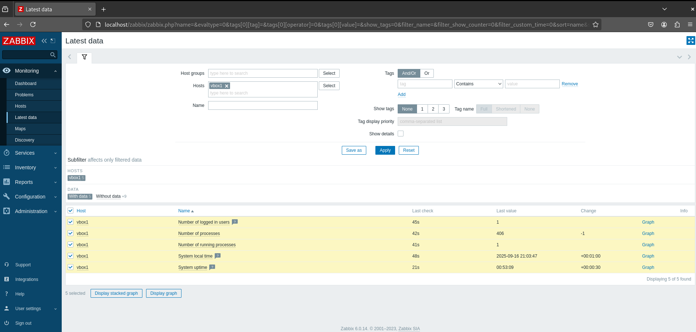
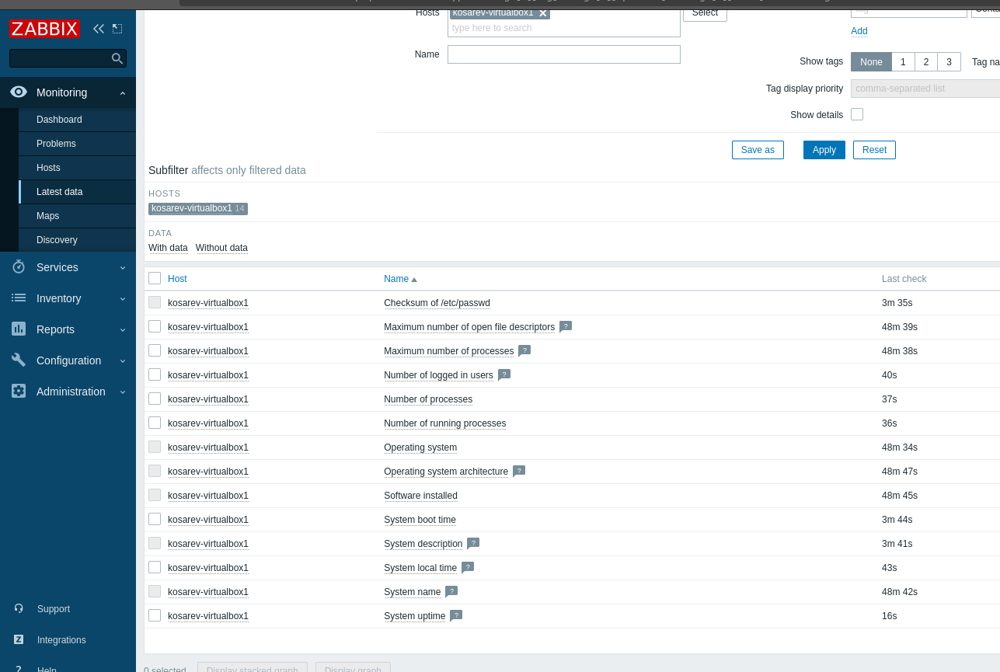

# Домашнее задание 2 - Мониторинг Zabbix

## Установка и настройка Zabbix Agent

### Выполненные задачи:
1. Установлен Zabbix Agent на два хоста
2. Настроена конфигурация агентов
3. Добавлены хосты в Zabbix Dashboard
4. Проверена работоспособность мониторинга

### Скриншот работы системы:
### VM1


### VM1


### Команды установки:
```bash
# Установка Zabbix Agent
sudo apt update
sudo apt install zabbix-agent

# Настройка конфигурации
sudo nano /etc/zabbix/zabbix_agentd.conf

# Перезапуск службы
sudo systemctl restart zabbix-agent

<- name: Install Скриншоты добавлены -->
